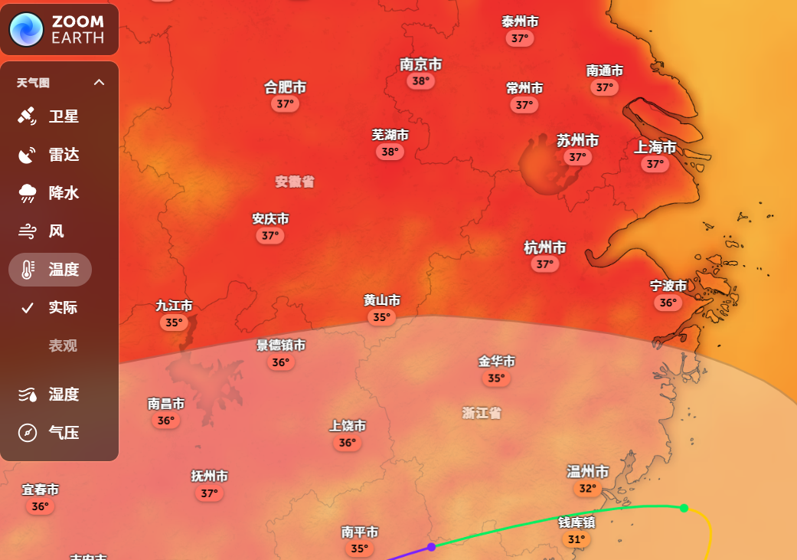

+++
title = "发现一个有意思的天气网站"
slug = "website-app-share"
description = "分享一些有趣的网站"
categories = ["share"]
tags = ["website"]
keywords = ["website"]
weight = 5
date = "2025-07-06 11:12:34+0800"
+++

# 天气地图

- 可以直观地看到不同地区的**气温**，**降水**，**台风**等
- 支持国外地区

[ZoomEarth传送门](https://zoom.earth/maps/temperature/#view=31.28,108.63,5z/model=icon)

Tips: 需要科学上网