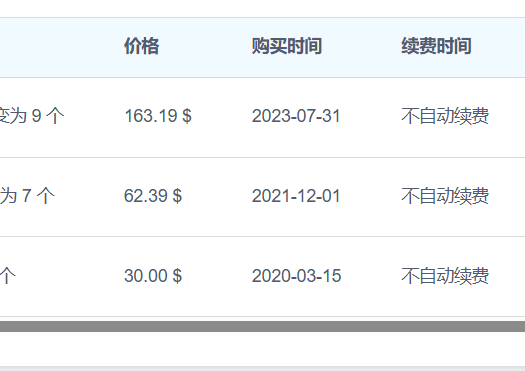

## 更新

2025-04-10 下午更新  

- 机场我还在用，我应该是20年注册的，应该有5年多了。  
（这么一个小站竟然没跑路，也挺神奇的）
- 这个机场的节点过一段时间就会更新地址，记得[刷新订阅 + 节点测速 + 重新选择最优节点]

2022-04-13 下午05:16更新  

今天v2ex的网友提出了这个机场的账号流量是`100G/月`，这是我之前没有注意到的，  
因为我平时使用完全够用，所有没有考虑这点，这里需要指出一下。

## 主页内容

两年前我也为了一个稳定的科学上网手段折腾过，还专门买过服务器自建Shadowsocks。  
后面发现这事不太靠谱，一但被墙锁定IP就要重新去VPS换新IP，不仅麻烦。  
而且换一次公网IP在很多VPS那边是收费项目。

这时候我发现机场才是我这样的懒人最需要的东西。  
交点钱，给我能稳定科学上网的节点，不要费心，不要整多余的事！  

目前这个机场我使用了2年半，感觉良好。  
关键胜在节点多，费用也比较便宜。(假如你有edu邮箱，性价比很高)  
所以推荐一下。

下面说几个重点：

- 这是个公益向站点。最好使用*教育网邮箱*注册，买套餐时会有50%优惠。
- 登陆这个机场有时候需要挂VPN.  [机场传送门 无AFF地址](https://okti.xyz/auth/register)
- 假如你注册时需要邀请码，可以试试这个`1KL9`, 对应的[邀请地址](https://okti.xyz/auth/register?code=1KL9)。  
通过邀请注册的用户可以获得0.99资金，可以买很多次公益节点套餐。
- 注册后加一下官方TG群！ 他的域名可能会换(旧域名称发生过被GFW拦截)
- 翻墙的客户端，Mac的话用的V2RayU / Windows V2RayN
- 提供的节点比较多，推荐测速一下，使用你那边`延迟最小`的那个节点。

最后的重点，**对于机场这东西，永远不推荐一上来就买长时间套餐！！**

假如你不放心，害怕他跑路，那就买个1毛钱/3毛钱的公益套餐`多试用几次`！  
1毛钱买不了吃亏买不了上当。

祝你们玩得开心~
