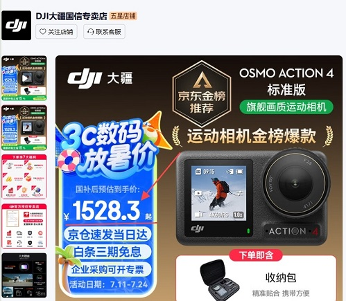
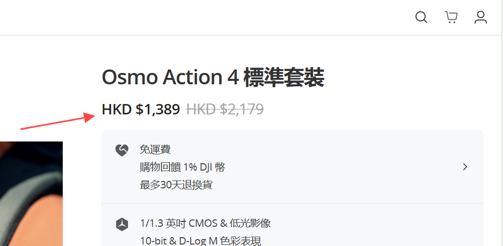
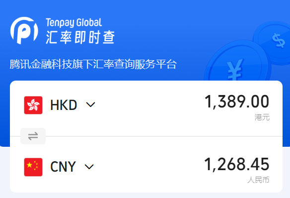
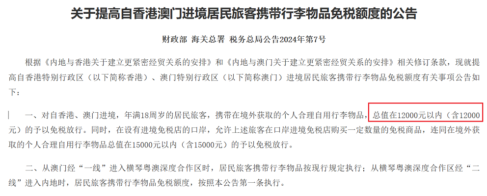

+++
title = "一个适合广深地区的副业思路"
slug = "sideline-idea-suitable-HK"
description = "记一次查询相机参数时产生的副业思路..."
categories = ["代码之外"]
tags = ["代码之外"]
keywords = ["代购", "副业"]
weight = 5
date = "2025-07-13 11:12:34+0800"
+++

# 副业代购的思路

最近在研究运动相机的参数时，发现的这个想法

大疆的`Action4`相机是目前很热门的一款产品，  
内地在国补后价格1500元以上，并且还不好抢。  
这导致就连某鱼上二手准新机也能出到1500R  

<!--  -->

目前香港的大疆官方店，行货价格在1389港币，换算成RMB大概是1268元，  
单台差价的232元，利润率 232/1268 = 18.3%  

	
关键点来了，内地的居民去香港，每间隔15天就能获得12000的免税额，  
按每个月去两次HK来算，一共是24000的免税额，    
全部利用上可以获得24000*0.183 = 4392的利润空间

Plus: 这里还没算上很多`万事达/Visa的信用卡`对境外消费有返现奖励      
延伸: 我相信还有很多其他的产品拥有值得考虑的差价，只是没有去收集

假设一个广深的打工人，周末的时候去香港玩，利用好免税额的规定，  
随便采购点东西卖卖，还是能回血不少。

所以把这个作为一个副业，一个月只需要做两天，收入保底4000+，还是不错的。   

